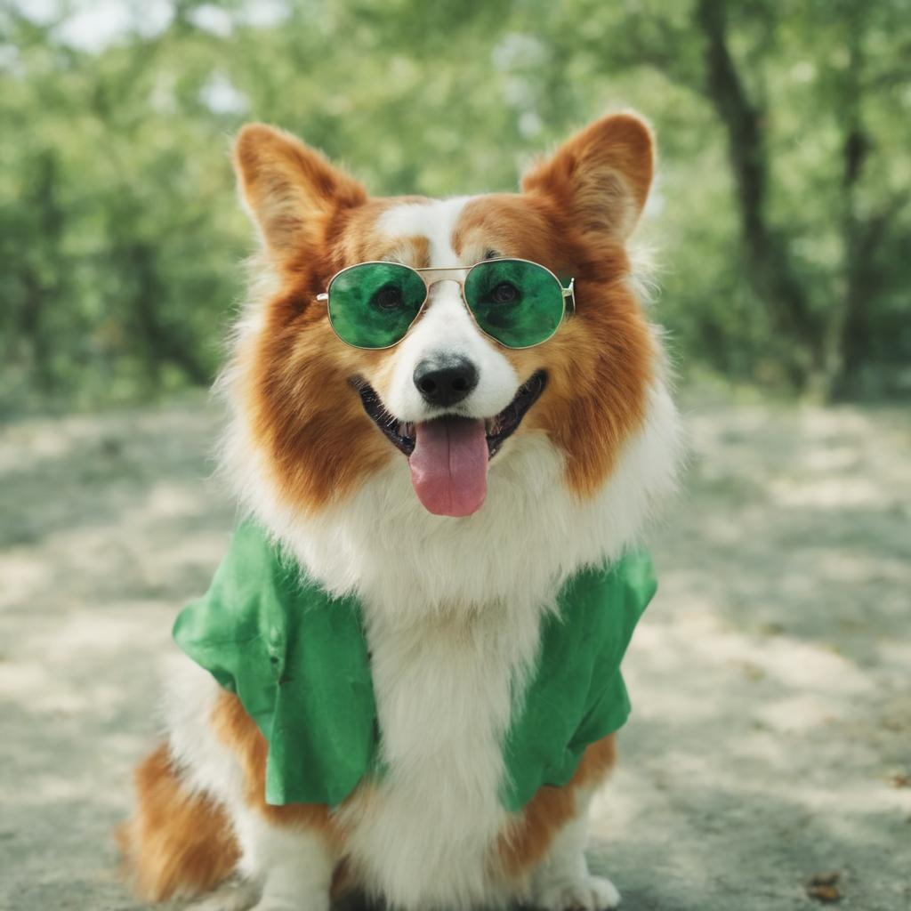

# Subject-driven Text-to-Image Generation via Preference-based Reinforcement Learning

This repo contains the official Pytorch/GPU implementation for the NeurIPS 2024 paper [Subject-driven Text-to-Image Generation via Preference-based Reinforcement Learning](https://arxiv.org/abs/2407.12164),
by Yanting Miao, William Loh, Suraj Kothawade, Pascal Poupart, Abdullah Rashwan, Yeqing Li. You can find more details/results on our [project page](https://andrew-miao.github.io/RPO/).

**TL;DR:**  We present the $\lambda$-Harmonic reward function and Reward Preference Optimization (RPO) for the subject-driven text-to-image generation task. 

RPO is an efficient subject-driven finetuning method that achieves the following performance on [DreamBench](https://github.com/google/dreambooth).

| $\lambda_{\text{val}}$ | DINO | CLIP-I| CLIP-T |
|----|----|----|----|
|0.3| 0.581  | 0.798 | 0.329|
|0.5| 0.652  | 0.833 | 0.314 |
|0.7| 0.679 | 0.850 | 0.304 |

**Note:** We also provide PRO with LoRA finetuning for [SDXL](https://arxiv.org/abs/2307.01952) in ```train_sdxl.py```, but we haven't evaluate the performance in DreamBench for this method.

## ⚙️ Setup
### Dataset
We use the DreamBench dataset as an example and this dataset can be replaced by your own datsets.

```
git clone https://github.com/google/dreambooth
```

### Installation
Download the coda
```
git clone https://github.com/andrew-miao/RPO
cd RPO
```
A [conda](https://docs.conda.io/en/latest/) environment named ```rpo-cuda``` can be created and acitvated with
```
conda env create -f environment.yml
conda activate rpo-cuda
```

## 🧑‍💻 Usage
### Training
For example, training the [```Stable Diffusion Models```](https://huggingface.co/stabilityai/stable-diffusion-2-1) for the specific [```dog```](https://github.com/google/dreambooth/tree/main/dataset/dog) in DreamBench using 1 a40 GPU can be

```
export MODEL_PATH="./logs/path-to-save-model/rpo/"
export REFERENCE_DIR="../dreambooth/dataset/dog"
export GENERATE_DIR="./logs/generate/dog"
export PROMPT='a photo of [V] dog'
export SUBJECT='dog'
export CLASS_TOKEN='dog'

accelerate launch train.py \
    --pretrained_model_name_or_path="stabilityai/stable-diffusion-2-1" \
    --reference_data_dir=$REFERENCE_DIR \
    --generated_data_dir=$GENERATE_DIR \
    --savepath=$MODEL_PATH \
    --beta=1.0 \
    --prompt="$PROMPT" \
    --resolution=512 \
    --train_batch_size=1 \
    --learning_rate=5e-6 \
    --max_train_steps=400 \
    --eval_steps=40 \
    --subject="$SUBJECT" \
    --class_token="$CLASS_TOKEN" \
    --reward_lambda=0.5
```

We also provide RPO-LoRA to finetune [SDXL](https://huggingface.co/stabilityai/stable-diffusion-xl-base-1.0):
```
export OUTPUT_DIR="./rpo_sdxl/logs/sdxl_results"
export REFERENCE_DIR="../dreambooth/dataset/dog"
export GENERATE_DIR="./rpo_sdxl/logs/generate/dog"
export PROMPT='a photo of [V] dog'
export SUBJECT='dog'
export CLASS_TOKEN='dog'

accelerate launch train_sdxl.py \
    --pretrained_model_name_or_path="stabilityai/stable-diffusion-xl-base-1.0" \
    --reference_data_dir=$REFERENCE_DIR \
    --generated_data_dir=$GENERATE_DIR \
    --class_token="$CLASS_TOKEN" \
    --output_dir=$OUTPUT_DIR \
    --learning_rate=1e-5 \
    --resolution=512 \
    --train_batch_size=1 \
    --max_train_steps=1000 \
    --seed=0
```

### Inference

The script for generating subject-driven images via the finetuned SD model can be

```
export MODEL_PATH="./logs/path-to-save-model/rpo/"
export SAVE_DIR="./logs/rpo/inference/dog"

accelerate launch inference.py \
    --pretrained_model_path=$MODEL_PATH \
    --save_dir=$SAVE_DIR \
    --prompt="a [V] dog wearing a green sunglasses" \
    --seed=0
```

For the finetuned SDXl model, the inference script is:
```
export MODEL_PATH="/scratch/ssd004/scratch/yanting/rpo_sdxl/logs/sdxl_results/checkpoint-1000"
export SAVE_DIR="/scratch/ssd004/scratch/yanting/logs/rpo_sdxl/inference/"
export PROMPT='a [V] dog wearing a green sunglasses'
export SUBJECT='dog'

accelerate launch inference_sdxl.py \
    --pretrained_model_name_or_path=$MODEL_PATH \
    --save_dir=$SAVE_DIR \
    --prompt="$PROMPT" \
    --subject="$SUBJECT" \
    --seed=0
```

## 🌠 Results
Results from SD:
|  |  |
|--------------------------------|--------------------------------|
|  |  |

Results from SDXL:
|  |  |
|--------------------------------|--------------------------------|
|  |  |

## 👓 Citation
If you find RPO useful in your research, please consider citing:
```
@inproceedings{
miao2024subjectdriven,
title={Subject-driven Text-to-Image Generation via Preference-based Reinforcement Learning},
author={Yanting Miao and William Loh and Suraj Kothawade and Pascal Poupart and Abdullah Rashwan and Yeqing Li},
booktitle={The Thirty-eighth Annual Conference on Neural Information Processing Systems},
year={2024},
}
```
## 📞 Contact
If you have any questions, feel free to contact me through email [y43miao@uwaterloo.ca](mailto:y43miao@uwaterloo.ca). Enjoy!
